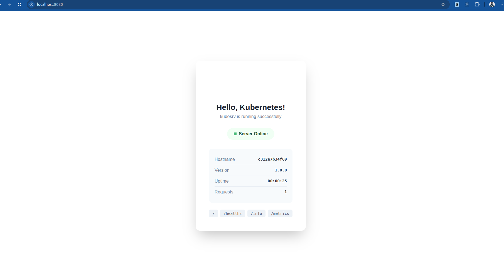

# kubesrv

Minimal HTTP server in C for Kubernetes testing.


## Features

- Ultra-small image (~26KB)
- Fork-based concurrency
- Kubernetes-aware identity endpoints
- Deterministic failure injection
- Latency simulation
- Health checks with proper semantics (/healthz vs /ready)
- Prometheus metrics with failure tracking
- Request echo/debug endpoint
- Configurable via environment variables
- Zero-shell, zero-tools image

## Quick Start

```bash
# Run locally
docker run -p 8080:80 bansikah/kubesrv:latest

# Deploy to Kubernetes
kubectl apply -f k8s/
kubectl port-forward svc/kubesrv-svc 8080:80 -n kubesrv-ns
```

## Endpoints

| Path | Description |
|------|-------------|
| `/` | HTML dashboard |
| `/healthz` | Liveness check (always returns 200 if process is alive) |
| `/ready` | Readiness check (503 for first 10s, then 200) |
| `/info` | JSON server info with uptime and request count |
| `/identity` | Kubernetes pod identity (pod, namespace, node, IP) |
| `/echo` | Request echo (method, path, client IP) |
| `/fail?code=500` | Simulate failures (supports 404, 500, 503) |
| `/sleep?ms=250` | Simulate latency (max 10000ms) |
| `/metrics` | Prometheus metrics (requests, failures, uptime) |

## Configuration

| Variable | Default | Description |
|----------|---------|-------------|
| `PORT` | `80` | Listen port |
| `MESSAGE` | `Hello, Kubernetes!` | Greeting message |
| `POD_NAME` | hostname | Pod name (auto-injected via Downward API) |
| `POD_NAMESPACE` | `default` | Pod namespace (auto-injected) |
| `POD_IP` | `unknown` | Pod IP (auto-injected) |
| `NODE_NAME` | `unknown` | Node name (auto-injected) |

## Use Cases

### Test Service Routing
```bash
curl http://kubesrv/identity
# Returns which pod handled the request
```

### Test Retry Logic
```bash
curl http://kubesrv/fail?code=503
# Simulates service unavailable
```

### Test Timeout Behavior
```bash
curl http://kubesrv/sleep?ms=5000
# Delays response by 5 seconds
```

### Test Readiness Semantics
```bash
# During first 10 seconds after pod start:
curl http://kubesrv/ready  # Returns 503

# After 10 seconds:
curl http://kubesrv/ready  # Returns 200
```

### Debug Ingress Headers
```bash
curl http://kubesrv/echo
# Returns request details
```

## Build

```bash
docker build -t bansikah/kubesrv:latest .
```

## License

GPL-3.0 - See [LICENSE](LICENSE)
