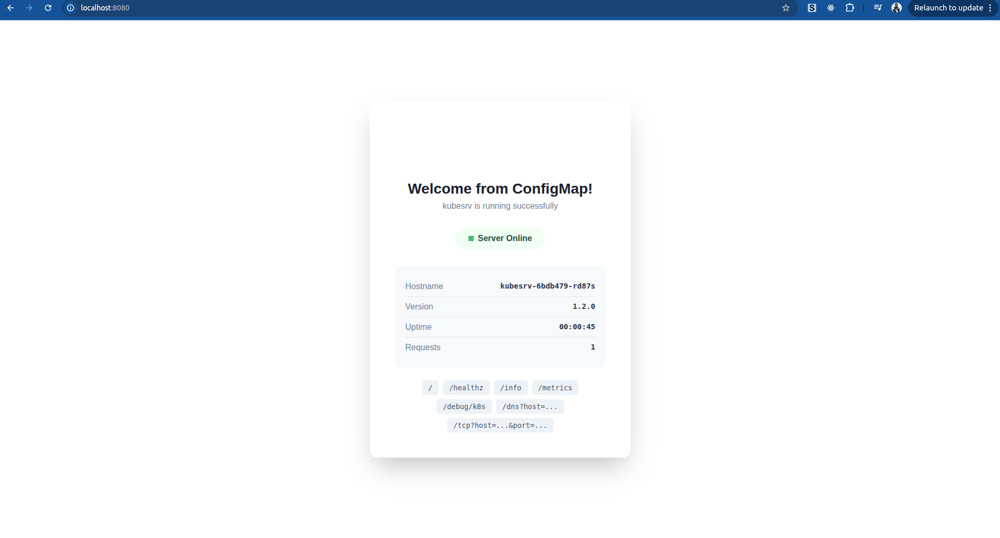

# kubesrv
[](https://github.com/bansikah22/kubesrv/actions/workflows/ci.yml)
[](https://github.com/bansikah22/kubesrv/actions/workflows/build.yml)
[](https://github.com/bansikah22/kubesrv/actions/workflows/helm-cd.yml)


Minimal HTTP server in C for Kubernetes testing.


## Features

- Ultra-small image (~26kb for v1.0.0(without shell) & 1MB for v1.1.0(with shell) )
- Fork-based concurrency
- Health checks (`/healthz`)
- Prometheus metrics (`/metrics`)
- Configurable via environment variables

## Quick Start

```bash
# Run locally
docker run -p 8080:80 bansikah/kubesrv:latest

# Deploy to Kubernetes using Manifests
kubectl apply -f k8s/
kubectl port-forward svc/kubesrv-svc 8080:80 -n kubesrv-ns

# Deploy to Kubernetes using Helm
helm install my-kubesrv ./charts/kubesrv
kubectl port-forward svc/my-kubesrv-kubesrv 8080:80
```

## Helm Chart

The project includes a reusable Helm chart located in `charts/kubesrv`. For detailed information on security features and customization, see the [Helm Documentation](docs/HELM.md).

### Installation

```bash
helm install [RELEASE_NAME] ./charts/kubesrv
```

### Configuration

The following table lists the configurable parameters of the kubesrv chart and their default values.

| Parameter | Description | Default |
|-----------|-------------|---------|
| `replicaCount` | Number of replicas | `1` |
| `image.repository` | Image repository | `bansikah/kubesrv` |
| `image.tag` | Image tag | `""` (defaults to chart appVersion) |
| `service.type` | Service type | `ClusterIP` |
| `service.port` | Service port | `80` |
| `config.message` | Greeting message | `"Hello, Kubernetes from Helm!"` |
| `resources.limits.cpu` | CPU limit | `100m` |
| `resources.limits.memory` | Memory limit | `32Mi` |

## Endpoints

| Path | Description |
|------|-------------|
| `/` | HTML dashboard |
| `/healthz` | Health check |
| `/info` | JSON server info |
| `/metrics` | Prometheus metrics |
| `/debug/k8s` | Kubernetes debug info |
| `/dns?host=<hostname>` | DNS lookup |
| `/tcp?host=<host>&port=<port>` | TCP connectivity test |

## Configuration

### Environment Variables

| Variable | Default | Description |
|----------|---------|-------------|
| `PORT` | `80` | Listen port |
| `MESSAGE` | `Hello, Kubernetes!` | Greeting message (fallback) |
| `MESSAGE_FILE` | - | Full path or filename to read message from |

### ConfigMap Volume Mount

You can mount any ConfigMap as a volume and specify the file path:

```yaml
apiVersion: v1
kind: ConfigMap
metadata:
  name: my-config
data:
  greeting.txt: |
    Hello from my custom ConfigMap!
---
apiVersion: apps/v1
kind: Deployment
spec:
  template:
    spec:
      containers:
      - name: kubesrv
        env:
        - name: MESSAGE_FILE
          value: "/usr/share/kubesrv/greeting.txt"  # Full path
        volumeMounts:
        - name: config
          mountPath: /usr/share/kubesrv
          readOnly: true
      volumes:
      - name: config
        configMap:
          name: my-config
```

**Priority order:**
1. File from `${MESSAGE_FILE}` (if set)
2. Environment variable `MESSAGE`
3. Default: "Hello, Kubernetes!"

### Downward API

The `/debug/k8s` endpoint relies on the Kubernetes Downward API to expose pod information as environment variables. You must configure your deployment to pass this information to the container.

```yaml
apiVersion: apps/v1
kind: Deployment
spec:
  template:
    spec:
      containers:
      - name: kubesrv
        env:
        - name: POD_NAME
          valueFrom:
            fieldRef:
              fieldPath: metadata.name
        - name: POD_NAMESPACE
          valueFrom:
            fieldRef:
              fieldPath: metadata.namespace
        - name: POD_IP
          valueFrom:
            fieldRef:
              fieldPath: status.podIP
        - name: NODE_NAME
          valueFrom:
            fieldRef:
              fieldPath: spec.nodeName
        - name: SERVICE_ACCOUNT
          valueFrom:
            fieldRef:
              fieldPath: spec.serviceAccountName
```

## Build

```bash
docker build -t bansikah/kubesrv:latest .
```

## CI/CD

The project includes automated workflows for continuous integration and deployment using GitHub Actions:

- **Build and Push**: Triggered on tags (e.g., `v1.0.0`), builds the Docker image and pushes it to the registry.
- **Helm CD**: Triggered on changes to Helm charts, performs linting, security scanning, and functional testing in a KinD cluster.

See [.github/workflows/](.github/workflows/) for details.

## License

GPL-3.0 - See [LICENSE](LICENSE)
